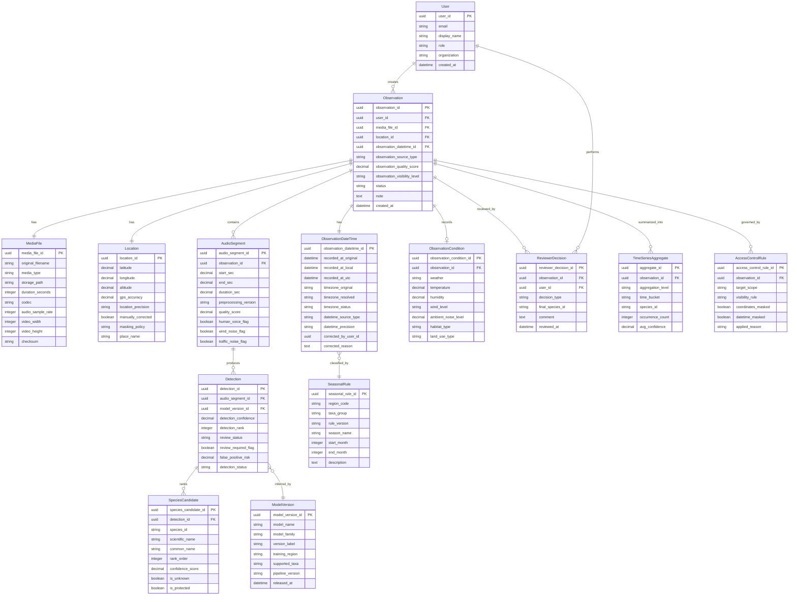
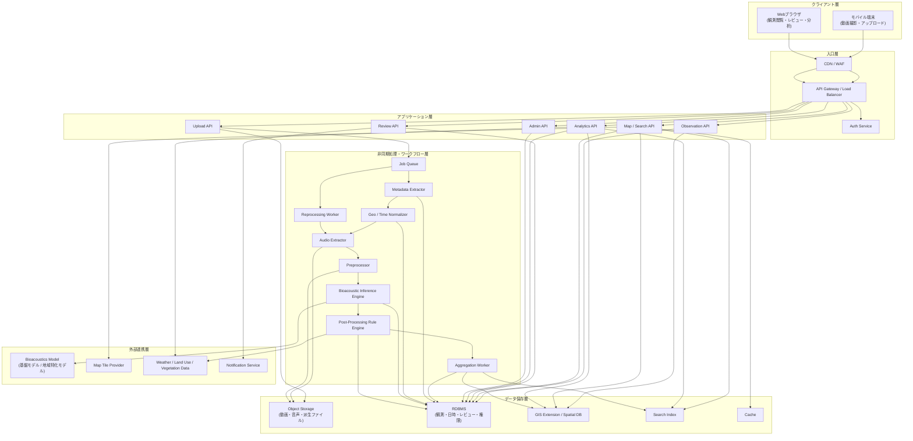
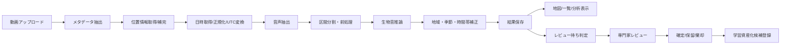
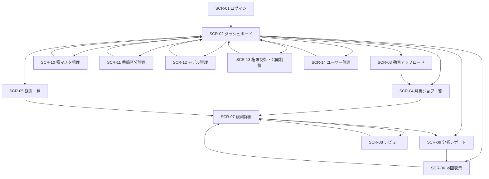

# 位置情報・日時情報付き動画音声による生物分布可視化システム
## ER図付き版 / システム構成図付き版 / 画面一覧＋画面遷移図付き版

- 文書名: 位置情報・日時情報付き動画音声による生物分布可視化システム 拡張要件定義書
- 版数: v1.1
- 作成日: 2026-04-18
- 想定プロジェクト名称: EcoAudio Mapper

---

## 1. 目的

本システムは、携帯電話等で撮影された**位置情報付き・日時情報付き動画**から音声を抽出し、周辺で発生した生物音を解析して、生物種または生物群の候補を推定し、その結果を**地図上および時系列上で可視化・蓄積・検索・分析**できる仕組みを提供することを目的とする。

本システムは、専門知識を持たない利用者でも一定水準の観測記録を作成できるよう支援しつつ、専門家による確認・補正を前提に、分布把握、季節変動把握、経年環境変化把握に活用できる観測基盤を構築する。

---

## 2. 背景

生態系の分析は、分類学、生態学、地域知識、季節変動、環境要因などの専門知識を必要とするため、一般利用者にとっては困難である。一方で、近年の生物音響解析技術の進展により、環境音から一部の生物の存在を推定できる可能性が高まっている。

この技術を活用し、スマートフォン等の一般的な端末で取得された動画から、位置情報と日時情報を伴う生物観測データを自動・半自動で抽出し、空間的・時間的に整理することで、以下を可能にする。

- 観測地点ごとの生物分布の把握
- 月別・季節別の出現傾向分析
- 年単位の出現変化や環境変化の把握
- 市民参加型観測の高度化
- 専門家レビューを前提とした観測支援

本システムは、**AIによる完全自動の確定同定**を目的とするものではなく、**位置情報と日時情報を持つ音響観測を整理・可視化し、専門家確認を支援する基盤**として位置づける。

---

## 3. 適用範囲

### 3.1 対象
- スマートフォンやタブレットで撮影された動画
- 動画内に含まれる環境音・生物音
- 動画ファイルまたは端末が持つ位置情報
- 動画ファイルまたは端末が持つ撮影日時情報
- 主として音による識別が期待できる分類群
  - 鳥類
  - 両生類
  - 一部昆虫
  - その他、音響モデルで対応可能な分類群

### 3.2 非対象
- 鳴き声を発しない生物の直接識別
- 単一観測のみを用いた厳密な個体数確定
- AIのみでの確定的な分類学的同定
- 法的証拠としての利用を前提とした確定判定
- 音声解析のみで生態系全体を完全把握すること

---

## 4. システム目的

1. 動画から音声、位置情報、日時情報を抽出する。  
2. 音響解析により周辺生物の候補を推定する。  
3. 推定結果に信頼度、観測位置、観測日時、音響断片を紐付ける。  
4. 地図上に観測点、推定分布、時系列変化を可視化する。  
5. 月別、季節別、年別の比較分析を可能にする。  
6. 専門家レビューにより推定結果を修正・承認・棄却できるようにする。  
7. 将来的に地域特化モデルや長期環境変化分析へ拡張できるようにする。  

---

## 5. 想定利用者

- 生態調査担当者
- 研究者
- 環境保全団体
- 自治体
- 教育機関
- 市民科学プロジェクト参加者
- 専門家レビュアー
- システム管理者

---

## 6. 利用シナリオ

### 6.1 市民参加型観測
利用者がスマートフォンで現地動画を撮影し、アップロードする。システムは音声を解析して候補種を推定し、撮影地点と撮影日時に基づいて観測マーカーを地図上へ表示する。

### 6.2 継続観測
特定地域で継続収集した動画群から、月ごと、季節ごと、年ごとの出現傾向を比較し、環境変化や生物相変化の兆候を確認する。

### 6.3 専門家確認
低信頼度または重要種に関する観測結果について、専門家がスペクトログラムと音声を確認し、候補を修正または確定する。

### 6.4 教育・啓発利用
学校や地域活動で収集した動画を用いて、地域の生物多様性や季節変化を可視化し、学習教材として利用する。

---

## 7. 業務要件

### 7.1 基本業務
- 動画の受領
- 動画メタデータの抽出
- 位置情報抽出または補完
- 日時情報抽出、正規化、精度管理
- 音声抽出
- 音響イベント検出
- 生物候補識別
- 結果保存
- 地図可視化
- 時系列分析
- 専門家レビュー
- 集計・出力

### 7.2 業務上の前提
- 位置情報は動画メタデータまたは端末付随情報から取得できることが望ましい。
- 位置情報欠損時には手動補完を可能とする。
- 観測日時は可能な限り元データから取得し、**元値・正規化値・タイムゾーン情報**を保持する。
- 日時不明または精度不十分なデータは、精度区分を付与して扱う。
- 生物判定は「候補」であり、必要に応じて専門家確認を経る。
- 稀少種や保護対象種の位置表示には制限を設ける。
- 発声源位置は撮影端末位置と一致しない可能性があることを前提とする。

---

## 8. 機能要件

### 8.1 データ取り込み機能
- 動画ファイルアップロード
- 複数ファイル一括投入
- モバイル端末からの直接登録
- 対応形式: mp4, mov を優先
- 撮影日時取得
- 緯度経度取得
- 観測者識別子の任意登録
- 手動位置補正
- 手動日時補正
- タイムゾーン情報保持
- 観測地点名付与
- 任意メモ、タグ、環境情報登録

### 8.2 音声抽出・前処理機能
- 動画から音声ストリームを抽出
- サンプリングレート正規化
- モノラル変換
- 音量正規化
- ノイズ抑制
- 音響イベント区間分割
- 無音区間除外
- 風音、人声、交通音等の干渉タグ付け
- 必要に応じた再処理

### 8.3 生物音識別機能
- 学習済みモデルによる推定
- 上位候補種の出力
- 信頼度スコア出力
- 区間ごとの推定
- 未知音・分類不能音の保持
- 地域別ホワイトリスト／ブラックリスト適用
- 季節性・時間帯・地域性を用いた事後補正
- カスタム分類器適用
- モデルバージョン管理

### 8.4 地図表示機能
- 観測点マーカー表示
- 推定種別フィルタ
- 日時範囲フィルタ
- 信頼度閾値フィルタ
- ヒートマップ表示
- グリッド集計表示
- クラスタ表示
- 観測詳細ポップアップ
- 元音声・元動画参照
- 航空写真／地形図切替
- 月別・季節別レイヤ切替
- 年別比較表示
- 時系列アニメーション表示

### 8.5 レビュー・検証機能
- 専門家レビュー画面
- 音声再生
- スペクトログラム表示
- 候補修正
- 確定、棄却、保留
- コメント付与
- 再学習候補マーキング
- レビュー履歴保存
- ダブルチェックフロー

### 8.6 分析・集計機能
- 種別出現回数集計
- 日時別出現傾向分析
- 地域別出現傾向分析
- 月別出現頻度分析
- 季節別出現傾向分析
- 年次推移分析
- 同一点の経年比較
- 長期的増減可視化
- 環境変化イベント前後比較
- CSV / JSON / GeoJSON 出力
- レポート出力

### 8.7 管理機能
- ユーザー管理
- 権限管理
- 種マスタ管理
- 地域マスタ管理
- 季節区分マスタ管理
- モデル管理
- 推論ジョブ管理
- データ保持期間設定
- 監査ログ閲覧
- APIキー管理
- 表示制御対象種管理

---

## 9. 日時情報・タイムゾーン要件

### 9.1 保持すべき日時関連項目
1. 観測日時原本値  
2. 観測日時正規化値  
3. タイムゾーン原本値  
4. タイムゾーン確定値  
5. UTC値  
6. 日時精度区分  
7. 日時取得元区分  
8. 日時補正履歴  

### 9.2 タイムゾーン明確化方針
- 取得日時がタイムゾーン付きの場合、その値を原本として保存する。
- 取得日時がタイムゾーン無しの場合、以下の順で補完を試みる。  
  1. 動画メタデータ内の撮影地情報  
  2. 位置情報から推定される地域タイムゾーン  
  3. ユーザー設定の既定タイムゾーン  
  4. 手動指定  
- タイムゾーン未確定の場合は未確定フラグを持たせる。
- 内部保存は UTC とローカル時刻の両方を保持する。
- 日付単位集計、季節集計、年次集計では、**分析対象地域のローカル時刻**を基準とする。

### 9.3 日時精度区分
- 正確
- 補正済み
- 推定
- 不明

### 9.4 比較単位
- 時
- 日
- 週
- 月
- 季節
- 年

### 9.5 季節区分要件
- 標準区分: 春 / 夏 / 秋 / 冬
- 拡張区分: 繁殖期 / 渡り期 / 越冬期 / 雨季 / 乾季
- 地域別または対象分類群別に区分ルールを持てること
- 季節区分ルールのバージョン管理ができること

---

## 10. 追加すべき重要項目

### 10.1 観測条件メタデータ
- 天候
- 気温
- 湿度
- 風の有無
- 周辺騒音レベル
- 土地利用区分
- 観測環境タグ

### 10.2 観測品質指標
- 録音品質スコア
- 雑音混入スコア
- 人声混入フラグ
- 風雑音フラグ
- 交通音フラグ
- 観測有効性スコア

### 10.3 保護対象種対応
- 稀少種・保護対象種の表示制限
- 公開時の座標丸め
- 管理者のみ精密座標閲覧可
- 出力時の自動マスキング

### 10.4 学習データ資産化
- レビュー済みデータの教師データ化
- 学習データ採否管理
- ラベル品質管理
- モデル改善候補リスト化

### 10.5 再現性管理
- 処理パイプラインバージョン保存
- 使用パラメータ保存
- モデルバージョン保存
- 前処理条件保存
- 再処理可能性の確保

### 10.6 観測地点の空間精度
- GPS精度情報保存
- 手動位置補正の有無
- 位置精度区分
- 観測点と発声源推定範囲の区別

### 10.7 法務・倫理配慮
- 個人会話の扱い制御
- 非公開地の扱い
- 稀少種位置の秘匿
- 利用規約・同意取得
- 学術・教育・公開利用での権限差分

---

## 11. 非機能要件

### 11.1 性能
- 10分以内の動画1本を実用時間内で処理できること
- 一括投入時もジョブキューにより安定稼働すること
- 地図表示および検索が実用的な応答時間であること

### 11.2 可用性
- 処理失敗時に再試行できること
- 長時間処理を中断・再開できること
- バッチ処理中でも最低限の閲覧機能を維持できること

### 11.3 拡張性
- モデル差し替えが可能であること
- 対象分類群追加が可能であること
- 外部GISや気象データ連携が可能であること
- 将来の画像解析統合に対応できること

### 11.4 保守性
- 音声抽出、推論、可視化、レビューを疎結合に構成すること
- ログ、監査情報、設定情報を明確に分離すること
- 再処理、差し替え、移行が容易な構成とすること

### 11.5 セキュリティ
- 認証・認可を備えること
- 通信は暗号化すること
- 保存データは適切に保護すること
- 位置情報と日時情報は権限に応じて制御すること

### 11.6 プライバシー
- 人声や個人情報を含む可能性があるため配慮すること
- 利用目的に応じた公開範囲制御が可能であること
- 公開時は必要に応じて位置・日時精度を落として表示できること

### 11.7 時系列整合性
- 観測日時は一貫した基準で保存すること
- UTC とローカル時刻を整合的に管理すること
- タイムゾーン未確定データを識別できること
- 季節分析時に地域ローカル時刻を使えること

---

## 12. データ要件

### 12.1 入力データ
- 動画ファイル
- 音声波形
- 緯度経度
- 位置精度
- 撮影日付
- 撮影時刻
- タイムゾーン
- 観測者情報
- 任意タグ
- 環境メモ
- 天候等の補足情報

### 12.2 管理データ
- 種マスタ
- 地域マスタ
- 季節区分マスタ
- モデルマスタ
- 観測イベント
- 音声区間情報
- 推論結果
- レビュー結果
- 出力履歴
- 時系列集計データ
- 補正履歴
- 公開制御設定

### 12.3 主要エンティティ
- User
- Observation
- MediaFile
- Location
- ObservationDateTime
- AudioSegment
- Detection
- SpeciesCandidate
- ReviewerDecision
- ModelVersion
- SeasonalRule
- TimeSeriesAggregate
- ObservationCondition
- AccessControlRule

---

## 13. ER図

### 13.1 ER図補足
- **Observation** を中心に、メディア、位置、日時、音声区間、推論結果、レビュー結果を接続する構造とする。
- **ObservationDateTime** を独立エンティティとし、原本日時、ローカル日時、UTC、タイムゾーン、精度区分、補正履歴を明確に管理する。
- **Detection** と **SpeciesCandidate** を分離し、1つの音声区間に対して複数候補と順位を持てるようにする。
- **AccessControlRule** により、稀少種や公開対象データの位置・日時マスキングを制御する。

---

## 14. システム構成図

### 14.1 システム構成方針
- **同期処理** はアップロード受付、検索、表示、レビュー入力を担当する。
- **非同期処理** はメタデータ抽出、日時正規化、音声抽出、推論、集計を担当する。
- **Object Storage** に原動画、抽出音声、派生スペクトログラム等を格納する。
- **RDBMS + GIS拡張** に観測・位置・日時・推論・レビュー・権限制御を格納する。
- **Search Index** に検索高速化用インデックスを保持する。
- **Rule Engine** で地域、季節、時間帯、公開制御等の補正・制限を実施する。

---

## 15. 主要処理フロー

---

## 16. 画面一覧

| 画面ID | 画面名 | 主目的 | 主な利用者 |
|---|---|---|---|
| SCR-01 | ログイン画面 | 認証 | 全利用者 |
| SCR-02 | ダッシュボード | 全体状況確認、入口提供 | 一般利用者 / 専門家 / 管理者 |
| SCR-03 | 動画アップロード画面 | 動画登録、位置・日時確認 | 一般利用者 |
| SCR-04 | 解析ジョブ一覧画面 | 解析進行状況確認 | 一般利用者 / 管理者 |
| SCR-05 | 観測一覧画面 | 観測レコード検索・絞込 | 全利用者 |
| SCR-06 | 地図表示画面 | 観測地点・分布可視化 | 全利用者 |
| SCR-07 | 観測詳細画面 | メディア、日時、位置、推論結果確認 | 全利用者 |
| SCR-08 | レビュー画面 | 音声再生、スペクトログラム、確定/修正 | 専門家 |
| SCR-09 | 分析レポート画面 | 集計、時系列比較、出力 | 研究者 / 管理者 |
| SCR-10 | 種マスタ管理画面 | 種情報管理 | 管理者 |
| SCR-11 | 季節区分管理画面 | 地域別季節ルール管理 | 管理者 |
| SCR-12 | モデル管理画面 | モデルバージョン管理 | 管理者 |
| SCR-13 | 権限制御・公開制御画面 | 稀少種・公開制御設定 | 管理者 |
| SCR-14 | ユーザー管理画面 | アカウント・ロール管理 | 管理者 |

---

## 17. 画面遷移図

---

## 18. 主要画面要件

### 18.1 SCR-03 動画アップロード画面
**主な機能**
- 動画ファイル選択
- 位置情報確認
- 位置手動補正
- 日時確認
- 日時手動補正
- タイムゾーン指定
- 観測メモ・タグ入力
- 登録実行

**主な項目**
- ファイル名
- 撮影日時原本
- タイムゾーン原本
- 補正後日時
- 緯度経度
- GPS精度
- 観測地点名
- 生息環境タグ
- 備考

### 18.2 SCR-06 地図表示画面
**主な機能**
- マーカー表示
- フィルタ
- ヒートマップ
- 時系列スライダー
- 月別/季節別/年別切替
- 詳細ポップアップ

**主な項目**
- 種フィルタ
- 信頼度閾値
- 日時範囲
- 季節区分
- 表示レイヤ
- 観測件数サマリ

### 18.3 SCR-07 観測詳細画面
**主な機能**
- 元動画参照
- 音声再生
- 推論結果表示
- 日時・タイムゾーン表示
- 補正履歴表示
- レビュー履歴表示
- 公開制御情報表示

### 18.4 SCR-08 レビュー画面
**主な機能**
- スペクトログラム表示
- 音声区間ごとの候補確認
- 候補修正
- 確定 / 棄却 / 保留
- コメント登録
- 学習用採否指定

### 18.5 SCR-09 分析レポート画面
**主な機能**
- 月別集計
- 季節別比較
- 年次比較
- 同一点比較
- CSV / GeoJSON 出力
- レポート保存

---

## 19. 役割別利用範囲

| 機能 | 一般利用者 | 専門家 | 管理者 |
|---|---:|---:|---:|
| 動画アップロード | ○ | ○ | ○ |
| 観測一覧閲覧 | ○ | ○ | ○ |
| 地図閲覧 | ○ | ○ | ○ |
| 観測詳細閲覧 | ○ | ○ | ○ |
| レビュー実施 | - | ○ | ○ |
| レポート出力 | △ | ○ | ○ |
| 種マスタ管理 | - | - | ○ |
| 季節区分管理 | - | - | ○ |
| モデル管理 | - | - | ○ |
| 公開制御管理 | - | - | ○ |
| ユーザー管理 | - | - | ○ |

※ △ は権限設定により許可可能とする。

---

## 20. 今後の拡張案

- 静止画・動画画像からの種候補統合
- 気象履歴との相関分析
- 土地利用変化との比較
- 植生変化との比較
- 録音専用モード
- オフライン一次推論
- 定点観測装置対応
- 渡りや繁殖期の補助分析
- 市民科学向け簡易アプリ化

---

## 21. 要件定義上の重要方針

本システムは、**位置情報と日時情報を持つ音響観測を時空間的に整理し、専門家確認を支援するシステム**である。

したがって、以下を基本方針とする。

- AI判定は候補提示であり、必要に応じて人が確認する
- 位置と日時は同等に重要な主キー情報として扱う
- タイムゾーンと日時精度を明示管理する
- 季節変動と経年変化の分析を前提に設計する
- 公開利用時は保護対象種とプライバシーに配慮する

---

## 22. 付録: 推奨追加管理項目一覧

### 22.1 Observation に追加推奨
- observation_source_type
- observation_quality_score
- datetime_precision
- timezone_status
- gps_accuracy
- observation_visibility_level

### 22.2 Detection に追加推奨
- detection_confidence
- detection_rank
- review_required_flag
- review_status
- false_positive_risk

### 22.3 Location に追加推奨
- latitude
- longitude
- altitude
- location_precision
- masking_policy

### 22.4 ObservationCondition に追加推奨
- weather
- temperature
- humidity
- wind_level
- ambient_noise_level
- habitat_type

### 22.5 ObservationDateTime に追加推奨
- recorded_at_original
- recorded_at_local
- recorded_at_utc
- timezone_original
- timezone_resolved
- datetime_source_type
- datetime_corrected_by
- datetime_corrected_reason

---

以上
